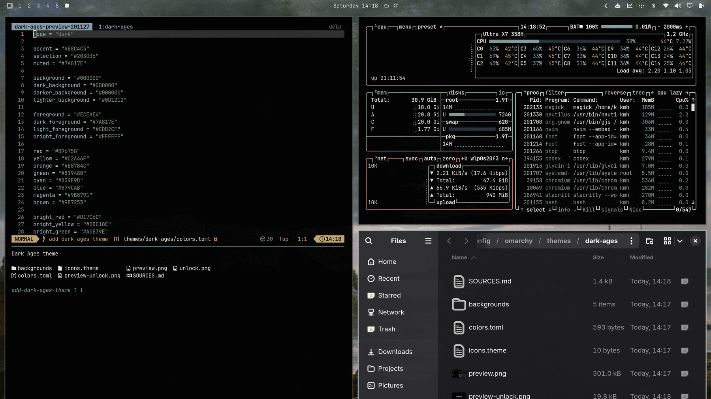
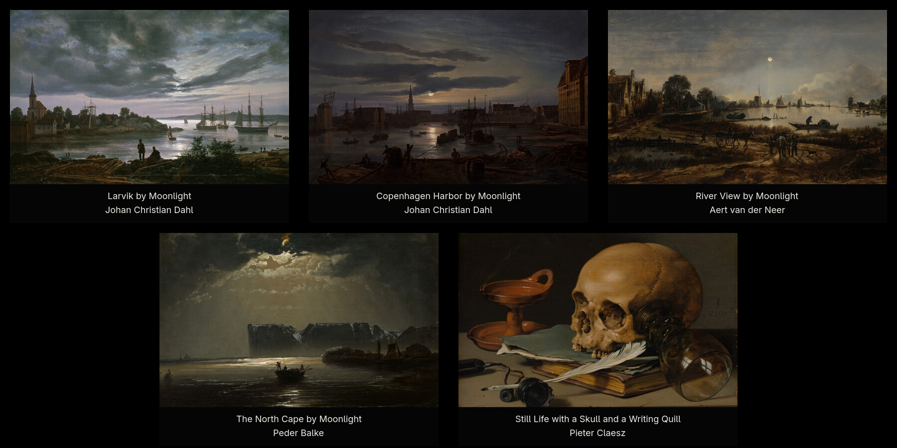

# Dark Ages for Omarchy

A deep-black Omarchy Quattro theme with a restrained, moonlit palette and five
public-domain paintings.



## Install

```bash
omarchy theme install https://github.com/stappmus/omarchy-dark-ages-theme.git
```

To apply it again later:

```bash
omarchy theme set dark-ages
```

Cycle through the included paintings with:

```bash
omarchy theme bg next
```

## Backgrounds

[](SOURCES.md)

The preview links to the artwork credits and public-domain source records.

## Included

- A true-black application and terminal palette
- Five high-resolution moonlit and vanitas backgrounds
- Yaru Gray icons
- Omarchy lock-screen assets

## Artwork and license

The theme configuration and documentation are released under the [MIT
License](LICENSE). The included artwork reproductions are identified as public
domain by their source institutions or source records; see [SOURCES.md](SOURCES.md)
for individual credits and links.
